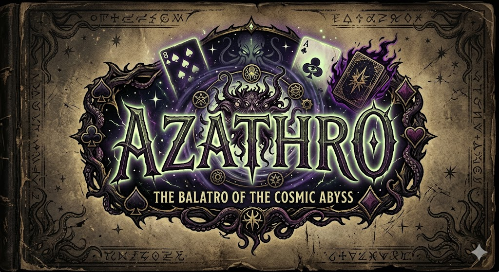

<p style="text-align: center;">
  
</p>

Ce projet est une version lite du jeu Balatro.
...

## Structure du projet

Le projet suit un modèle MVC (model view controller).

```
src/fr/uge/azathro/
├── Main.java
├── domain/
│   ├── types/               
|   │   ├── combination/
|   │   ├── rank/
|   │   └── suit/
|   │   └── planet/         
│   ├── Card.java      
│   ├── Blind.java       
│   ├── Deck.java      
│   ├── Hand.java        
│   └── HandEvaluator.java
├── model/
│   ├── GameState.java 
│   └── PlayerState.java
├── controller/
│   └── GameController.java
│   └── GraphicGameController.java
└── view/   
       └──  View.java
       └──  ViewState.java
              
```
On a fait le choix dans le domain d'inclure tous les objets représentants des notions "métiers" du jeu balatro, comme les cartes, les blinds, les mains, les planètes etc... 
On a aussi inclus dans le domain un Dealer qui est chargé de calculer le score d'une main. (Comme le ferait le croupier dans un casino).
Le model contient l'état du jeu et du joueur, tandis que le controller gère la logique du jeu et la communication entre le model et la view. 
La view est chargée de l'affichage du jeu.
## Comment importer le projet

- Télécharger et décompresser l'archive .zip
- Ouvrir le projet dans Eclipse (open projects from file system).
- Vérifier que l'environnement d'exécution et la compilation sont bien en Java25


## Comment lancer le programme

- Sur Eclipse, lancer directement le programme sur Main.java (se trouvant dans src/fr.uge.azathro)
Si vous utilisez la ligne de commande, compilez tous les fichiers .java et lancez Main.java.
Si vous souhaitez lancer la vu graphic rajouter l'argument "--graphic" à l'exécution de Main.java

## Fonctionalités implémentées
- représentation des cartes avec les combinaisons de poker
- une pioche de 52 cartes
- calcul correct du score des mains. Score cumulé à chaque main et réinitialisé à 0 à chaque début de blind
- boucle de jeu: 5 blinds constituées d'un nombre de mains limités, le jouer pioche 8 cartes et joue une main de 1 à 5 cartes à chaque tour. L'échec d'un blind met immédiatement fin au jeu.
- Gestion des planètes en fin de Blind avec leurs effets sur les combinaisons
- vue console fonctionnelle
- vue graphique fonctionnelle mais imparfaite


## Amélioration probables
Il manque un message de victoire sur la partie graphique, et la vue graphique est encore très basique.
Interface graphique : utiliser des sprites pour les cartes, améliorer la disposition des éléments, ajouter des animations pour les actions du jeu.
Extras à minima que nous allons réaliser : Score par cartes et Défausse active.
Celle qu'on pourrait faire si on voit qu'on a plus de temps : Shop et gestion de Jokers.


